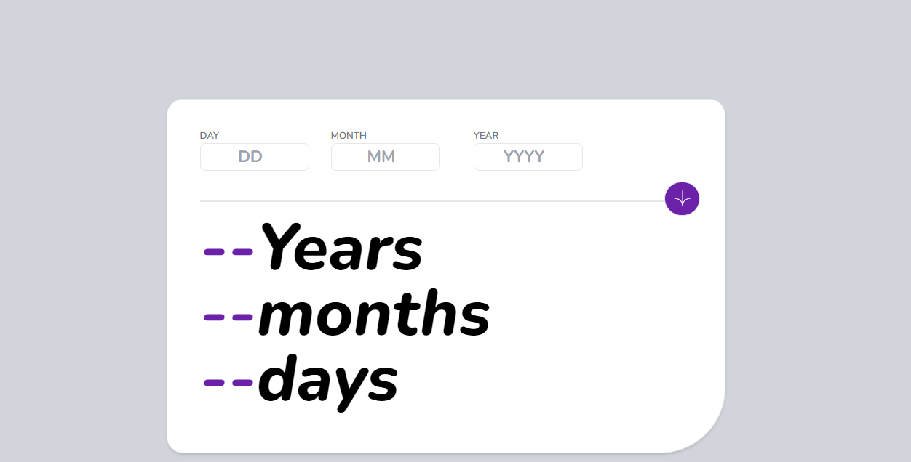
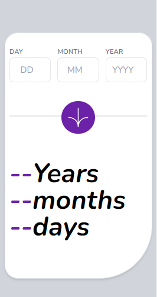

# Frontend Mentor - Age calculator app solution

This is a solution to the [Age calculator app challenge on Frontend Mentor](https://www.frontendmentor.io/challenges/age-calculator-app-dF9DFFpj-Q). Frontend Mentor challenges help you improve your coding skills by building realistic projects.

## Table of contents

- [Overview](#overview)
  - [The challenge](#the-challenge)
  - [Screenshot](#screenshot)
  - [Links](#links)
  - [Built with](#built-with)
  - [What I learned](#what-i-learned)
  - [Continued development](#continued-development)
- [Author](#author)
- [Acknowledgments](#acknowledgments)

## Overview

An age calculator app challenge from Frontend mentor. The developer is tasked with building this web app to make it as similar to the design as possible. Tech stacks that are necessary to build this project includes HTML, CSS and JavaScript. Of course, other technologies can be incorporated into this project. Since I am familiar with Tailwind CSS, I will be using it to build this web app.

### The challenge

Users should be able to:

- View an age in years, months, and days after submitting a valid date through the form
- Receive validation errors if:
  - Any field is empty when the form is submitted
  - The day number is not between 1-31
  - The month number is not between 1-12
  - The year is in the future
  - The date is invalid e.g. 31/04/1991 (there are 30 days in April)
- View the optimal layout for the interface depending on their device's screen size
- See hover and focus states for all interactive elements on the page

### Screenshot

### Links

- Live Site URL: [age-calculator-appk.vercel.app](https://age-calculator-appk.vercel.app/)

### Built with

- Semantic HTML5 markup
- CSS custom properties
- Tailwind CSS

### What I learned

This project taught me a lot about CSS grids and layouts. I learnt how to build a responsive site. I also learnt how to use Tailwind CSS which I used for the first time in this project.

### Continued development

There are still some things to be improved in this app. For example, the font family used is not as identical as the design. I will love to improve on this in the future.

## Author

- Frontend Mentor - [@yourusername](https://www.frontendmentor.io/profile/yourusername)
- Twitter - [@itzz_okure](https://twitter.com/itzz_okure)

## Acknowledgments

I thank all those who have helped me since I started my journey as a software developer. Thank you all for the encouragement.
